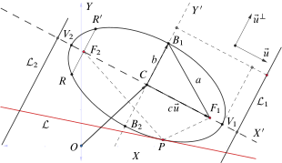

# Ecuaciones diferenciales con coeficientes variables
$$ \begin{pmatrix}
123&4&5&6\\
1&1&1&1\\
1&1&1&177
\end{pmatrix}$$
\[
M = 
\left(\begin{array}{c|cc}
   A & B &\\
   \hline
   C & D &77\\
   C & D &77\\
   \hline
   C & D &77\\
   \hline
   \begin{array}{c|cc}
   A & B &\\
   \hline
   C & D &77\\
   C & D &77\\
   \hline
   C & D &77\\
   C & D &77_{11}\\
\end{array} & D &77_{11}\\
\end{array}\right)
\]

```{theorem} 
En la elipse se verifican las siguientes igualdades


1. $d\left[B_1;F_i\right]=d\left[B_2;F_i\right]=a$

  2. $d\left[V_1;C\right]=d\left[V_2;C\right]=a$

  3. $d\left[C;\mathcal{L}_1\right]=d\left[C;\mathcal{L}_2\right]=\frac{c}{e}$
  
  4. $c=d\left[P;F_1\right]=d\left[P;F_2\right]$ entonces $c=ae$

```

```{proof}

1. Ya que $d\left[B_1;F_1\right]+d\left[B_1;F_2\right]=2a=d\left[B_2;F_1\right]+d\left[B_2;F_2\right]$ es decir $2d\left[B_1;F_i\right]=2a=2d\left[B_2;F_i\right]$ entonces $d\left[B_1;F_i\right]=a=d\left[B_2;F_i\right]$ $i=1,2$. 
  
2. Por la definición \@ref(eq:binom) de la elipse se tiene
\begin{equation}
d\left[V_1;F_2\right]+d\left[V_1;F_1\right]=2a
(\#eq:er)
\end{equation} 
además la diferencia 
\begin{equation}
d\left[V_1;F_2\right]-d\left[V_1;F_1\right]=2c
(\#eq:err)
\end{equation}
restando las ecuaciones \@ref(eq:er) y \@ref(eq:err) se tiene 
\begin{equation}
d\left[V_1;F_1\right]=a-c
(\#eq:errr)
\end{equation}
entonces haciendo uso de \@ref(eq:errr) en $d\left[V_1;C\right]=d\left[V_1;F_1\right]+d\left[F_1;C\right]=(a-c)+c=a$; de manera  similar para el vértice $V_2$.

  3.  En efecto $$\frac{d\left[B;F_i\right]}{d\left[B;\mathcal{L}_i\right]}=e\Longleftrightarrow \frac{a}{d\left[B;\mathcal{L}_i\right]}=e$$ además $d\left[B_i;\mathcal{L}_i\right]=d\left[C;\mathcal{L}_i\right]$ por lo tanto   $\frac{a}{d\left[C;\mathcal{L}_i\right]}=e$.
  
  3. Pues $$\frac{d\left[P;F_1\right]}{d\left[P;\mathcal{L}_1\right]}=e$$ implica $\frac{a-c}{\frac{a}{e}-a}=e$ es decir $c=ae$. 

Por lo tanto 
```
Table: (\#tab:ww) Caption

  | Sepal.Length| Sepal.Width| Petal.Length|
  |:------------:|:-----------:|------------:|
  |          5.1|         3.5|          1.4|
  |          4.9|         3.0|          1.4|
  |          4.7|         3.2|          1.3|
  |          4.6|         3.1|          1.5|
La tabla \@ref(tab:ww)

```{r f1, echo=FALSE, fig.cap="Elipse", fig.align="center"}

```
\index{fff}
Sea la Tabla \@ref(tab:ww) y la Figura \@ref(fig:f1)