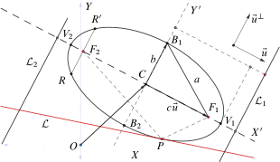

--- 
title: "Ecuaciones diferenciales ordinarias"
author: "Ricardo Michel MALLQUI BAÑOS"
institute: "Universidad Nacional San Cristóbal De Huamanga"
date: "`r Sys.Date()`"
site: bookdown::bookdown_site
documentclass: krantz
link-citations: yes
subparagraph: yes
colorlinks: yes
fontsize: 10pt
bibliography: [book.bib, packages.bib]
biblio-style: apalike
lot: yes
lof: yes
monofont: "Source Code Pro"
monofontoptions: "Scale=0.7"
toc_appendix: yes
description: ""
---
\newcommand{\N}{\mathbb{N}}
\newcommand{\R}{\mathbb{R}}
\newcommand{\CC}{\mathbb{C}}
\newcommand{\I}{\mathbb{I}}
\newcommand{\f}{\mathbb{f}}
\newcommand{\X}{\mathbb{X}}
\newcommand{\D}{\mathbb{D}}
\newcommand{\Z}{\mathbb{Z}}
\newcommand{\Q}{\mathbb{Q}}
\newcommand{\norm}[1]{\left\Vert#1\right\Vert}
\newcommand{\abs}[1]{\left\vert#1\right\vert}
\newcommand{\set}[1]{\left\{#1\right\}}
\newcommand{\seq}[1]{\left<#1\right>}
\newcommand{\co}[1]{\left[#1\right]}
\newcommand{\cc}[1]{\left(#1\right)}
\newcommand{\J}{\mathcal{J}}
\newcommand{\K}{\mathcal{K}}
\newcommand{\M}{\mathcal{M}}
\newcommand{\F}{\mathcal{F}}

# Resumen {-}


Este libro sobre ecuaciones diferenciales ordinarias y sus aplicaciones cuyo objetivo es demostrar resultados básicos muy útiles en el desarrollo de investigaciones.

$$\sum_{i=1}^2=\lim_{x\to\infty}x_i\int x_idx$$

# Introducción {-}


$$\sum_1^2$$

$$\vec{u}=(1,1)-\rho\int_2^3$$

Debido a la poca información estructurada de estadistica descriptiva se propone escribir este libro con un enfoque demostrativo.


$$x^2+y^2$$ 

<!--chapter:end:index.Rmd-->

\mainmatter 

# Ecuaciones diferenciales de primer orden y primer grado

Una ecuación ordinaria de primer orden y primer grado se representa como $$F\left(x,y,\frac{dy}{dx}\right)=0$$ donde $F$ relaciona tres variables; una funcion $y$ su variable independiente $x$  y su derivada $\frac{dy}{dx}$, por ejemplo $\left(y^2+xy^2\right)\frac{dy}{dx}+x^2-x^2y=0$. Si se despeja $\frac{dy}{dx}$ de $F\left(x,y,\frac{dy}{dx}\right)=0$ obtenemos $\frac{dy}{dx}=g(x,y)$.


## Ecuaciones diferenciales de variable separable

Si una ecuación ordinaria de primer orden y primer grado $\frac{dy}{dx}=f(x,y)$ se puede expresarse como $M(x)dx+N(y)dy=0$ entonces la ecuación recibe el nombre de ecuación diferencial ordinaria de variable separable y la solución es por integración directa $$\int M(x)dx+\int N(y)dy=0$$


```{exercise}
$\left(y^2+xy^2\right)\frac{dy}{dx}+x^2-x^2y=0$
```

```{solution}
\begin{align*}
0&=y^2\left(1+x\right)dy+x^2\left(1-y\right)dx\\
&=\frac{y^2}{1-y}dy+\frac{x^2}{1+x}dx
\end{align*}

integrando se tiene $$\int\frac{y^2}{1-y}dy+\int\frac{x^2}{1+x}dx=\int 0$$
$$(x+y)(x-y-2)+2\ln\left\vert\frac{1+x}{1-y}\right\vert=k$$
```


```{exercise}
$\left(y^2+xy^2\right)\frac{dy}{dx}+x^2-x^2y=0$
```

```{solution}
\begin{align*}
0&=y^2\left(1+x\right)dy+x^2\left(1-y\right)dx\\
&=\frac{y^2}{1-y}dy+\frac{x^2}{1+x}dx
\end{align*}

integrando se tiene $$\int\frac{y^2}{1-y}dy+\int\frac{x^2}{1+x}dx=\int 0$$
$$(x+y)(x-y-2)+2\ln\left\vert\frac{1+x}{1-y}\right\vert=k$$
```

## Ecuaciones diferenciales reducible a variable separable
Ecuaciones de la forma
\begin{equation}
\frac{dy}{dx}=f(ax+by+c)(\#eq:er1)
\end{equation}
donde $ax+by+c$ es la ecuacion de una recta sobre el plano euclideo son reducibles a variables separables. Si se realiza la sustitución de la derivada de $z=ax+by+c$ en la ecuación \@ref(eq:er1) se obtiene una ecuación de variable separable. En efecto de $z=ax+by+c$ se tiene $\frac{dy}{dx}=\frac{1}{b}\left(\frac{dz}{dx}-a\right)$ esto en \@ref(eq:er1) genera $\frac{1}{b}\left(\frac{dy}{dx}-a\right)=f(z)$ que es una ecuacion de variable separable $$\frac{dy}{a+bf(z)}=dx.$$


## Ecuaciones diferenciales homogéneas
```{definition}
Una función $f(x,y)$ es **homogenea** de **grado** $k$ si verifica $$f\left(\lambda x, \lambda y\right)=\lambda^kf(x,y)$$
```

```{example}
wwwwwwwww
```

## Ecuaciones diferenciales reducible a homogéneas

## Ecuaciones diferenciales exactas

## Ecuaciones diefrenciales lineales de primer orden

## Ecuaciones diefrenciales de Bernoulli
Son de la forma
\begin{equation}
\frac{dy}{dx}+p(x)y+q(x)y^{2}=f(x)
(\#eq:w1w)
\end{equation}

La ecuación se resuelve si solo se conoce una solución particular \(y_{1}(x)\). Conocida dicha solución, se hace el cambio
\begin{equation}
y(x)=z(x)+y_{1}(x)
(\#eq:w2)
\end{equation}
despejando \( \frac{dy}{dx}\) en la Ecuación \@ref(eq:w1w) y comparando con la derivada de la Ecuación \@ref(eq:w2), se obtiene 
\[\frac{dy}{dx}=-p(x)y-q(x)y^{2}+f(x)=\frac {dz(x)}{dx}+\frac {dy_{1}}{dx}
\]
además ya que \(y_1\) es solución de Ecuación \@ref(eq:w1)  es decir:
\begin{align}
-p(x)y-q(x)y^{2}+f(x)&=\frac{dz}{dx}-p(x)y_{1}(x)-q(x)y_{1}(x)^{2}+f(x)\notag\\
\frac{dz}{dx}&=p(x)(y_{1}-y)+q(x)(y_{1}^{2}-y^{2})(\#eq:w3)
\end{align}
la Ecuación \@ref(eq:w2) genera \(y_1-y=-z\) y \(y_1^2-y^2=z^2+2y_1z\) lo cual al sustituirlos en la Ecuación \@ref(eq:w3) resulta
\begin{align*}
\frac{dz}{dx}&=-p(x)z-q(x) \left(z^{2}+2zy_{1}\right)\\
&=-\left(p(x)+2q(x)y_{1}(x)\right)z-q(x)z^{2}
\end{align*}
que corresponde a una ecuación diferencial de Bernoulli.

```{remark}
Obsérvese que si se hace la sustitución:
\[y(x)=y_{1}(x)+{\frac {1}{z(x)}}\]
propuesta por Euler en la década de 1760 esto lleva directamente a una ecuación lineal diferencial de primer orden.
```


## Ecuaciones diferenciales de Riccati


## Ecuaciones diferenciales de Lagrange y Clairouts


## Ecuaciones diferenciales no resueltas con respecto a la primera derivada


```{exercise}
Sean los datos 
```

```{solution}
Entonces
  
```


<!--chapter:end:01.Rmd-->

# Aplicaciones de las ecuaciones ordinarias


## Aplicados a problemas geométricos

## Aplicados atrayectorias ortogonales

## Aplicaciones a la temperatura


## Descomposición crecimiento y reacciones químicas

## Aplicaciones a circuitos eléctricos simples

## Aplicaciones a la economía

Son aquellas medidas que buscan un dato representtivo central de un conjunto de datos tales como la media, la moda y la mediana.

## La media ($\overline{x}$)
A veces llamada _promedio aritmético_, es la medida de tendencia central que pondera los datos.

### Media de datos no agrupados
Los datos no están agrupados cuando no están ordenados sobre una tabla de distribución de frecuencias. Sean los $n$ datos $x_1, x_2,\ldots, x_n$ entonces la media o promedio aritmético se define como 
\begin{equation}
\overline{x}=\frac{x_1+x_2+\cdots+x_n}{n}=\frac{1}{n}\sum_{i=1}^nx_i
(\#eq:w1)
\end{equation}
\begin{equation}
\frac{d\left[P;F_1\right]}{d\left[P;\mathcal{L}_1\right]}=e=\frac{d\left[P;F_2\right]}{d\left[P;\mathcal{L}_2\right]}
(\#eq:ww)
\end{equation}

1. $\overline{x}=\frac{x_1+x_2+\cdots+x_n}{n}=\frac{1}{n}\sum_{i=1}^nx_i$
2. $\overline{x}=\frac{x_1+x_2+\cdots+x_n}{n}=\frac{1}{n}\sum_{i=1}^nx_i$ 


### Media de datos agrupados

Considérese la siguiente tabla de distribucion de frecuencias entonces el promedio es $$\overline{x}=\frac{y_1f_1+y_2f_2+\cdots+y_nf_n}{n}=\frac{1}{n}\sum_{i=1}^ny_if_i$$


| Clase| Clase | $f_i$ | $F_i$ | $F_i^*$ | $h_i$ | $H_i$ | $H_i^*$ | $\ldots$ | $H_i\%$ | $H_i^*\%$ 
|:---:|:---:|:---:|:---:|:---:|:---:|:---:|:---:|:---:|
| $<y_1-y_2>$ |$y_1$| $f_1$ | $F_1$ | $F_1^*$ | $\frac{f_1}{n}$ | $\frac{F_1}{n}$ | $\frac{F_1^*}{n}$|$\ldots$|$H_1$|$H_1^*$|
| $<y_2-y_3>$ |$y_2$| $f_2$ | $F_2$ | $F_2^*$ | $\frac{f_2}{n}$ | $\frac{F_2}{n}$ | $\frac{F_2^*}{n}$|$\ldots$|$H_2$|$H_1^*$|
| $<y_3-y_4>$ |$y_3$| $f_3$ | $F_3$ | $F_3^*$ | $\frac{f_3}{n}$ | $\frac{F_3}{n}$ | $\frac{F_3^*}{n}$|$\ldots$|$H_3$|$H_1^*$|
| $\vdots$ | $\vdots$ | $\vdots$ | $\vdots$ |       $\vdots$ | $\vdots$ | $\vdots$|$\vdots$|$\vdots$|$\vdots$|$\vdots$|
| $<y_{r-1}-y_r]$ |$y_r$| $f_r$ | $F_r$ |$F_r^*$ | $\frac{f_r}{n}$ | $\frac{F_r}{n}$ | $\frac{F_r^*}{n}$|$...$|$H_r$|$H_1^*$|


```{exercise}
Si el promedio de $n$ datos es $\overline{x}$ entonces el promedio del conjunto inicial más un dato adicional $x_{n+1}$ es $$\overline{x}'=\frac{n\overline{x}+x_{n+1}}{n+1}$$ en general si se adicionan $r$ datos $y_1, y_2, \ldots y_r$ entonces el nuevo promedio será $$\overline{x}'=\frac{n\overline{x}+y_{1}+y_2+\ldots+y_r}{n+r}$$
```

```{solution}
En efecto sea el promedio 
\begin{align*}
\overline{x}'&=\frac{x_1+x_2+\cdots+x_{n+1}}{n+1}\\
&=\frac{n\frac{x_1+x_2+\cdots x_n}{n}+x_{n+1}}{n+1}\\
&=\frac{n\overline{x}+x_{n+1}}{n+1}
\end{align*}
````
## La moda (Mo)

### Moda de datos no tabulados
En este caso es dato que más repite en un conjunto de datos dados. 


La moda es el dato que más se repite por ejemplo sea el conjunto de datos $x_1,$ $x_2,$ $x_2,$ $x_2,$ $x_3$ entonces la moda $\text{Mo}=x_2$ 


### Moda de datos tabulados

La moda es el dato que más se repite por ejemplo sea el conjunto de datos $x_1,$ $x_2,$ $x_2,$ $x_2,$ $x_3$ entonces la moda $\text{Mo}=Li+\frac{Li-Ls}{Li+Ls}r$ 


| Clase| Clase | $f_i$ | $F_i$ | $F_i^*$ | $h_i$ | $H_i$ | $H_i^*$ | $\ldots$ | $H_i\%$ | $H_i^*\%$ 
|:---:|:---:|:---:|:---:|:---:|:---:|:---:|:---:|:---:|
| $[y_1-y_2>$ |$y_1$| $f_1$ | $F_1$ | $F_1^*$ | $\frac{f_1}{n}$ | $\frac{F_1}{n}$ | $\frac{F_1^*}{n}$|$\ldots$|$H_1$|$H_1^*$|
| $<y_1-y_2>$ |$y_2$| $f_2$ | $F_2$ | $F_2^*$ | $\frac{f_2}{n}$ | $\frac{F_2}{n}$ | $\frac{F_2^*}{n}$|$\ldots$|$H_2$|$H_1^*$|
| $<y_{r}-y_r>$ |$y_3$| $f_3$ | $F_3$ | $F_3^*$ | $\frac{f_3}{n}$ | $\frac{F_3}{n}$ | $\frac{F_3^*}{n}$|$\ldots$|$H_3$|$H_1^*$|
| $\vdots$ | $\vdots$ | $\vdots$ | $\vdots$ |       $\vdots$ | $\vdots$ | $\vdots$|$\vdots$|$\vdots$|$\vdots$|$\vdots$|
| $<y_{r-1}-y_r]$ |$y_r$| $f_r$ | $F_r$ |$F_r^*$ | $\frac{f_r}{n}$ | $\frac{F_r}{n}$ | $\frac{F_r^*}{n}$|$...$|$H_r$|$H_1^*$|


## la mediana (Me)

### Mediana de datos no tabulados
Obtener la mediana consiste en ordenar los datos de menor a mayor y considerar dos casos: El prmero si el numero de datos s impar entonces el dato $x_{\frac{n+1}{2}}$ del conjunto ordenado será la mediana es decir $\text{Me}=x_{\frac{n+1}{2}}$ de otro lado si el número de datos es par entonces la mediana es la semisuma de los dos datos intermedios es decir $\text{Me}=\frac{x_{\frac{n}{2}}+x_{\frac{n}{2}+1}}{2}$

```{exercise}
Sean los conjuntos de datos 5, 6, 8, 2, 1, 5, 6, 7, 10, 0, 14 y 20, 25, 6, 5, 19, 5 obtener la mediana de estos conjuntos de datos.
```

```{solution}
Al ordenarlos  se obtiene el siguiente arreglo 0, 1, 2, 5, 5, 6, 6, 7, 8, 10, 14 y considerando que $x_1=0$, $x_2=1$, $\ldots$, $x_{11}=14$ en este caso el número de datos es impar entonces el dato $x_{\frac{11+1}{2}}=x_{6}=6$ el la mediana. De otro lado el segundo conjunto de datos al ser ordenados 5, 5, 6, 19, 20, 25 ademas considerando que $x_1=5$, $x_2=5$, $\ldots$, $x_6=25$ conducen a obtener la mediana $\text{Me}=\frac{x_{\frac{6}{2}}+x_{\frac{6}{2}+1}}{2}=\frac{6+19}{2}=12.5$.
```


### Mediana de datos tabulados


| Clase| Clase | $f_i$ | $F_i$ | $F_i^*$ | $h_i$ | $H_i$ | $H_i^*$ | $\ldots$ | $H_i\%$ | $H_i^*\%$ 
|:---:|:---:|:---:|:---:|:---:|:---:|:---:|:---:|:---:|
| $[y_1-y_2>$ |$y_1$| $f_1$ | $F_1$ | $F_1^*$ | $\frac{f_1}{n}$ | $\frac{F_1}{n}$ | $\frac{F_1^*}{n}$|$\ldots$|$H_1$|$H_1^*$|
| $<y_1-y_2>$ |$y_2$| $f_2$ | $F_2$ | $F_2^*$ | $\frac{f_2}{n}$ | $\frac{F_2}{n}$ | $\frac{F_2^*}{n}$|$\ldots$|$H_2$|$H_1^*$|
| $<y_{r}-y_r>$ |$y_3$| $f_3$ | $F_3$ | $F_3^*$ | $\frac{f_3}{n}$ | $\frac{F_3}{n}$ | $\frac{F_3^*}{n}$|$\ldots$|$H_3$|$H_1^*$|
| $\vdots$ | $\vdots$ | $\vdots$ | $\vdots$ |       $\vdots$ | $\vdots$ | $\vdots$|$\vdots$|$\vdots$|$\vdots$|$\vdots$|
| $<y_{r-1}-y_r]$ |$y_r$| $f_r$ | $F_r$ |$F_r^*$ | $\frac{f_r}{n}$ | $\frac{F_r}{n}$ | $\frac{F_r^*}{n}$|$...$|$H_r$|$H_1^*$|

Los pasos son:

* Se halla $\frac{n}{2}$ luego 
* $x_n$ 
* 

<!--chapter:end:02.Rmd-->

# Ecuaciones diferenciales lineales de orden superior

## Ecuaciones diferenciales lineales homogeneas con coeficientes constantes 
## Ecuaciones diferenciales lineales no homogeneas con coeficientes constantes 

## Método de variación de parámetros

## Ecuaciones diferenciales de Euler


<!--chapter:end:03.Rmd-->

# Operadores diferenciales 


<!--chapter:end:04.Rmd-->

# Ecuaciones diferenciales con coeficientes variables
$$ \begin{pmatrix}
123&4&5&6\\
1&1&1&1\\
1&1&1&177
\end{pmatrix}$$

Entonces

\[
M = 
\left(\begin{array}{c|cc}
   A & B &\\
   \hline
   C & D &77\\
   C & D &77\\
   \hline
   C & D &77\\
   \hline
   \begin{array}{c|cc}
   A & B &\\
   \hline
   C & D &77\\
   C & D &77\\
   \hline
   C & D &77\\
   C & D &77_{11}\\
\end{array} & D &77_{11}\\
\end{array}\right)
\]

```{theorem} 
En la elipse se verifican las siguientes igualdades


1. $d\left[B_1;F_i\right]=d\left[B_2;F_i\right]=a$

  2. $d\left[V_1;C\right]=d\left[V_2;C\right]=a$

  3. $d\left[C;\mathcal{L}_1\right]=d\left[C;\mathcal{L}_2\right]=\frac{c}{e}$
  
  4. $c=d\left[P;F_1\right]=d\left[P;F_2\right]$ entonces $c=ae$

```

```{proof}

1. Ya que $d\left[B_1;F_1\right]+d\left[B_1;F_2\right]=2a=d\left[B_2;F_1\right]+d\left[B_2;F_2\right]$ es decir $2d\left[B_1;F_i\right]=2a=2d\left[B_2;F_i\right]$ entonces $d\left[B_1;F_i\right]=a=d\left[B_2;F_i\right]$ $i=1,2$. 
  
2. Por la definición de la elipse se tiene
\begin{equation}
d\left[V_1;F_2\right]+d\left[V_1;F_1\right]=2a
(\#eq:er)
\end{equation} 
además la diferencia 
\begin{equation}
d\left[V_1;F_2\right]-d\left[V_1;F_1\right]=2c
(\#eq:err)
\end{equation}
restando las ecuaciones \@ref(eq:er) y \@ref(eq:err) se tiene 
\begin{equation}
d\left[V_1;F_1\right]=a-c
(\#eq:errr)
\end{equation}
entonces haciendo uso de \@ref(eq:errr) en $d\left[V_1;C\right]=d\left[V_1;F_1\right]+d\left[F_1;C\right]=(a-c)+c=a$; de manera  similar para el vértice $V_2$.

  3.  En efecto $$\frac{d\left[B;F_i\right]}{d\left[B;\mathcal{L}_i\right]}=e\Longleftrightarrow \frac{a}{d\left[B;\mathcal{L}_i\right]}=e$$ además $d\left[B_i;\mathcal{L}_i\right]=d\left[C;\mathcal{L}_i\right]$ por lo tanto   $\frac{a}{d\left[C;\mathcal{L}_i\right]}=e$.
  
  3. Pues $$\frac{d\left[P;F_1\right]}{d\left[P;\mathcal{L}_1\right]}=e$$ implica $\frac{a-c}{\frac{a}{e}-a}=e$ es decir $c=ae$. 

Por lo tanto 
```

Table: (\#tab:ww) Caption

  | Sepal.Length| Sepal.Width| Petal.Length|
  |:------------:|:-----------:|-------------:|
  |          5.1|         3.5|          1.4|
  |          4.9|         3.0|          1.4|
  |          4.7|         3.2|          1.3|
  |          4.6|         3.1|          1.5|
La tabla \@ref(tab:ww)

```{r f1, echo=FALSE, fig.cap="Elipse", fig.align="center"}

```
\index{fff}
Sea la Tabla \@ref(tab:ww) y la Figura \@ref(fig:f1) entonces 

<!--chapter:end:05.Rmd-->

# Solucion de ecuaciones diferenciales mediante la Trasformada de Laplace 

Example text outside R code here; we know the value of
pi is In this section, we give a very brief introduction to Pandoc’s Markdown. Readers who are familiar with Markdown can skip this section. The comprehensive syntax of Pandoc’s Markdown can be found on the Pandoc website http://pandoc.org.

> "I thoroughly disapprove of duels. If a man should challenge me,
  I would take him kindly and forgivingly by the hand and lead him
  to a quiet place and kill him."

In this section, we give a very brief introduction to Pandoc’s Markdown. Readers who are familiar with Markdown can skip this section. The comprehensive syntax of Pandoc’s Markdown can be found on the Pandoc website http://pandoc.org. $\sum_1^2$

> I thoroughly disapprove of duels. If a man should challenge me,
  I would take him kindly and forgivingly by the hand and lead him
  to a quiet place and kill him.
>
> -- Mark Twain

$$\begin{pmatrix}\alpha & \beta\\
\gamma & \delta
\end{pmatrix}-\frac{2}{3} \begin{pmatrix}\alpha_1 & \beta_2\\
\gamma & \delta
\end{pmatrix}$$
* La suma de dos matrices $A_{n\times m}$ y $B_{r\times s}$ $$A_{n\times m}\pm B_{n\times m}=[a_{ij}+b_{ij}]$$
* El producto de dos matrices $A_{n\times m}$ y $B_{r\times s}$ $$A_{n\times m}\cdot B_{n\times m}=[a_{ij}+b_{ij}]$$
$$X = \begin{bmatrix}1 & x_{1}\\
1 & x_{2}\\
1 & x_{3}
\end{bmatrix}$$

$$\begin{vmatrix}a & b\\
c & d
\end{vmatrix}=ad-bc$$

$$\begin{array}{ccc}
x_{11} & x_{12} & x_{13}\\
x_{21} & x_{22} & x_{23}
\end{array}$$


<!--chapter:end:06.Rmd-->

# (APPENDIX) Apendice {-}
# Operadores diferenciales

Una suma de números representados por $x_1, x_2, \ldots, x_n$ se simboliza en forma compacta mediante el simbolo $\sum$ (sigma) es decir la suma de los números anteriores se puede escribir del siguiente modo $$x_1+x_2+\dots+x_n=\sum_{i=1}^nx_i.$$
Algunas propiedades son 

1. $k\sum_{i=1}^nx_i=\sum_{i=1}^nkx_i$
2. $\sum_{i=1}^n\left(x_i+y_i\right)=\sum_{i=1}^nx_i+\sum_{i=1}^ny_i$
3. $\sum_{i=1}^nx_i$
$$\int_1^3=\lim_{n\to \infty}\sum_{i=0}^{n}f^i(x)$$
citado por [@xie2015] y [@R-base] www

## ee

## eeeee

# Trasformada de Laplace

Una matriz es un arreglo de números distribuidos en filas y columnas por ejemplo la siguiente matriz
$$A=\begin{pmatrix}
a_{11}&a_{12}&\ldots&a_{1n}\\
a_{21}&a_{22}&\ldots&a_{2n}\\
\vdots & \vdots & \ddots &\vdots \\
a_{11}&a_{11}&\ldots&a_{nm}
\end{pmatrix}_{n\times n}$$
de **orden** $n\times m$ tiene **entradas** $a_{ij}$ donde el primer subindice indica la fila y el segundo la columna; es usual representar por simplicidad una matriz por $A=[a_{ij}]_{n\times m}$. Si en el orden $n=m$  entonces la matriz recibe el nombre de **matriz cuadrada**  la suma de los elementos de la diagonal de una matriz cuadrada $\sum_{i=1}^na_{ii}$ se llama **traza**\index{traza}. Si todas las $a_{ij}$ son cero entonces la matriz $A=0$ recibe el nombre matriz **nula**.

Dos matrices son iguales si tienen el **mismo orden** y cada una de las entradas respectivas son iguales es decir $A=[a_{ij}]_{n\times m}$ y $B=[b_{ij}]_{n\times m}$ son iguales si $a_{ij}=b_{ij}$, $i=1,2,\ldots n$ y $j=1,2,\ldots m$

## Algebra de matrices
Sean las matrices $A=[a_{ij}]_{n\times m}$ y $B=[b_{ij}]_{p\times q}$ entonces la suma y producto de matrices se definen

1. Sea $k$ un escalar entonces se verifica que $kA=[ka_{ij}]$, $i=1,2,\ldots n$ y $j=1,2,\ldots m$ es decir el escalar\index{escalar} $k$ multiplica a cada una de las entradas de la matriz.

2. La suma o diferencia es posible si $n=p$ y $m=q$ es decir los ordenes de $A$ y $B$ son iguales, entonces la suma o diferencia resulta $A\pm B=[a_{ij}+b_{ij}]_{n\times m}$, $i=1,2,\ldots n$ y $j=1,2,\ldots m$ 

3. El producto es posible si $m=p$ es decir el número columnas de la primera matriz es igual al número de filas de la segunda matriz, el orden de la matriz resultante es $n\times q$ además 
\begin{align*}
A\cdot B&=\left[\sum_{k=1}^pa_{ik}b_{kj}\right]_{n\times q}\\
&=\begin{pmatrix}
\sum_{k=1}^ma_{1k}b_{k1}&\sum_{k=1}^ma_{1k}b_{k2}&\ldots&\sum_{k=1}^ma_{1k}b_{kq}\\
\sum_{k=1}^ma_{2k}b_{k1}&\sum_{k=1}^ma_{2k}b_{k2}&\ldots&\sum_{k=1}^ma_{2k}b_{kq}\\
\vdots & \vdots & \ddots &\vdots \\
\sum_{k=1}^ma_{nk}b_{k1}&\sum_{k=1}^ma_{nk}b_{k2}&\ldots&\sum_{k=1}^ma_{nk}b_{kq}\\
\end{pmatrix}_{n\times q}
\end{align*}

donde $i=1,2,\ldots n$ y $j=1,2,\ldots m$

```{example}
Sean $\begin{pmatrix}
3&-1&2\\
2&-1&2\\
1&-1&0\\
5&0&0\\
\end{pmatrix}_{4\times 3}$ y $\begin{pmatrix}
0&-1&2&2&0\\
1&-1&-2&1&1\\
3&-1&-3&5&2\\
\end{pmatrix}_{3\times 5}$ entonces $$A\cdot B=\begin{pmatrix}
5&-4&2&15&3\\
5&-3&0&13&3\\
-1&0&4&1&-1\\
0&-5&10&10&0\\
\end{pmatrix}_{4\times 5}$$
```
En caso de ser posible la multiplicación entre $A$, $B$ y $C$ entonces se verfican las siguientes propiedades

* $A(B+C)=AB+AC$
* $(A+B)C$
* $A(BC)=(AB)C$

<!--chapter:end:07.Rmd-->

`r if (knitr::is_html_output()) '
# Referencias {-}
'`

<!--chapter:end:08.Rmd-->

